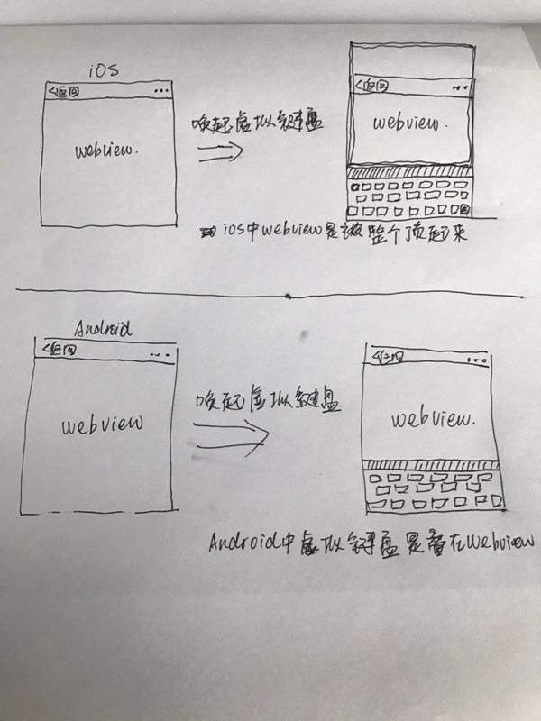

# @各种坑

## @`iOS`中 `fixed`之坑

```html
<!DOCTYPE html>
<html>
<head>
    <meta http-equiv="Content-Type" content="text/html; charset=UTF-8">
    <title>fixed</title>
    <style type="text/css">
        input{
            position: fixed;
            z-index: 999;
            bottom: 0;
            left: 0;
        }
    </style>
</head>

<body>
    <input type="text" name="" value="">
</body>

</html>

```

唤起虚拟键盘时`input`会错乱问题;   
   
(手滑,请忽略字丑)    
面对这个问题,目前是通过`css` || `js` 改变样式来解决

### `js` 的解决方案

``` JavaScript
// 改变定位状态
function fixedWatch(el) {
    if(document.activeElement.nodeName == 'INPUT'){
        el.css('position', 'static');
    } else {
        el.css('position', 'fixed');
    }
}
// iscroll.js 目前并不推荐这个, 性能太差劲
```

#### `css` 的解决方案
```css
// 1.用新属性
input{
    position: sticky;
    z-index: 999;
    bottom: 0;
    left: 0;
}

// 2.参考 twitter 的 ratchet库
// 原理是模拟一个body容器出来
#content{
    position: absolute;
    z-index: 1;
    top: 0;
    bottom: 0;
    left: 0;
    right: 0;
    margin: auto;
    width: 100%;
    height: 100%;
    max-width: 10rem;
    overflow-y: auto;
    -webkit-overflow-scrolling: touch;
}
```


## @`input`的 `compositionstart` 和 `compositionend`

想象一个场景,用户输入内容,我们要对用户输入的内容进行检查限制;   
理想状态是用户输入完内容过后才对输入的内容进行判断,但是`iOS`中会出现用户触摸虚拟键盘的每一个按钮都会触发检查机制,这显然不是我们想要的;   
这个时候就可以通过`compositionstart` 和 `compositionend`来做开关了

```javascript
var power = false;
function do(inputElement) {
    var regex = /[^1-9a-zA-Z]/g;
    inputElement.value = inputElement.value.replace(regex, '');
}

inputElement.addEventListener('compositionstart', function() {
    power = true;
});


inputElement.addEventListener('compositionend', function(event) {
    power = false;
    do(event.target);
})


inputElement.addEventListener('input', function(event) {
    if (!power) {
        do(event.target);
        event.returnValue = false;
    }
});

```

## @参考

<a href="https://github.com/twbs/ratchet" target="_blank">twbs/ratchet</a>


<a href="http://www.alloyteam.com/2015/06/yi-dong-web-wen-ti-xiao-jie/" target="_blank">移动web问题小结</a>
